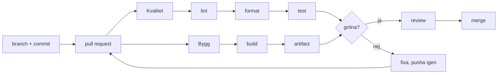

# CI/CD-pipeline

Pipelinen körs på varje pull request mot `main` och på varje push till `main`. Workflowen ligger i `.github/workflows/ci.yml`.

## Flöde från commit till merge

Pipelinen har två jobb som körs parallellt:

- **Kvalitet** kör lint, formatkontroll och test, i den ordningen.
- **Bygg** bygger applikationen och laddar upp `client/dist` som artifact.

Båda jobben installerar beroenden med `npm ci`, som installerar exakt de versioner som står i `package-lock.json`. Inga steg i CI använder `--fix` eller `--write`, så pipelinen rättar aldrig koden själv. Den säger bara till om något är fel.

## Vad varje steg fångar

| Steg | Kommando | Fångar |
|---|---|---|
| Installation | `npm ci` | Att `package-lock.json` stämmer med `package.json` och att alla dependencies går att installera |
| Lint | `npm run lint` | Kodfel som går att hitta utan att köra koden exempelvis oanvända variabler `v-for` utan `:key` och felstavade namn |
| Format | `npm run format:check` | Kod som inte följer Prettiers formatering ex indrag, citattecken och tomma rader |
| Test | `npm test` | Kod som inte beter sig som förväntat exempelvis att en vy inte visar rätt data |
| Bygge | `npm run build` | Fel som bara syns när appen byggs för produktion exempelvis felaktiga importer eller filnamn med fel stor bokstav |

Lint, format och test gäller just nu bara `client/`. Bygget omfattar både `web/` och `client/`.

## Uppmätta tider

Tiderna är hämtade från en körning i GitHub Actions.

| Steg | Tid |
|---|---:|
| `npm ci` i Kvalitet | 3 s |
| `lint` | 1 s |
| `format:check` | 0 s |
| `test` | 2 s |
| `npm ci` i Bygg | 4 s |
| `build` | 1 s |
| Hela körningen | 12 s |

## Ruleset på `main`

`main` är skyddad med ett ruleset som kräver:

- att alla ändringar går via en pull request
- minst en godkännare
- att status checks från workflowen (**Kvalitet** och **Bygg**) är gröna
- att branchen är uppdaterad mot `main` innan merge
- att reglerna gäller alla även admins

Om något steg misslyckas blockeras merge. Felet måste åtgärdas och en ny commit pushas och då körs pipelinen igen.
